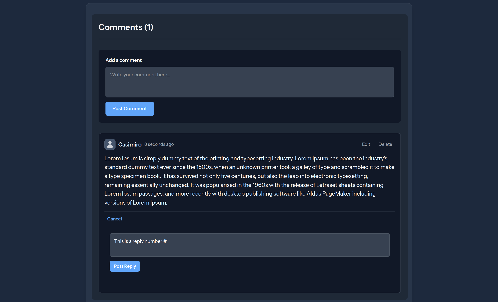

# Laravel Comments Threads

A Laravel Blade Livewire package for threaded comments with nested replies.

## Screenshots





## Installation

```bash
composer require modularavel/commentable
```

## Publish Configuration & Assets

```bash
php artisan vendor:publish --tag=comments-config
php artisan vendor:publish --tag=comments-migrations
php artisan vendor:publish --tag=comments-views
```

## Run Migrations

```bash
php artisan migrate
```

## Usage

### In Your Blade View

```blade
<livewire:comment-thread :commentable="$post" />
```

### Make Your Model Commentable

```php
use LaravelComments\Threads\Traits\Commentable;

class Post extends Model
{
    use Commentable;
}
```

## Configuration

Edit `config/comments.php` to customize:
- User model
- Pagination settings
- Moderation options
- Display preferences

## Features

- Nested comment replies
- Real-time updates with Livewire
- User authentication integration
- Edit and delete comments
- Customizable views
- Pagination support
- Markdown support (optional)

## License

MIT

## Test

```bash
composer test
```